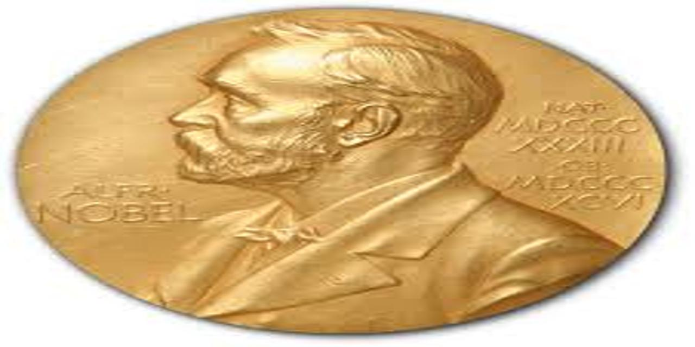

# Prof. Taback's project for 2025 UTSSRP

This repo contains data and code for a project developed by [Prof. Nathan Taback](https://utstat.toronto.edu/nathan/) with assistance from Leo Watson for the June 2025 [UTSSRP—Statistical Sciences Research Program.](https://www.statistics.utoronto.ca/UTSSRP) 

Students who participate in this project will have the opportunity to develop basic competencies in:

* Programming with data
* Using an API to gather data
* Exploring data
* Visualizing data
* Communicating statistical results
* Collaboration and team work
* Developing and evaluating statistical models such as:
    - Linear regression
    - Generalized linear models
    - Bayesian hierarchical models

These competencies will help evaluate the following research question:

> Among Nobel Prize winners in Physics, Chemistry, and Biology, what is the relationship between scientific impact of a paper and the timing of the paper during a scientist's career? Does this relationship depend on a scientist's age, gender, team size, or prize category?

